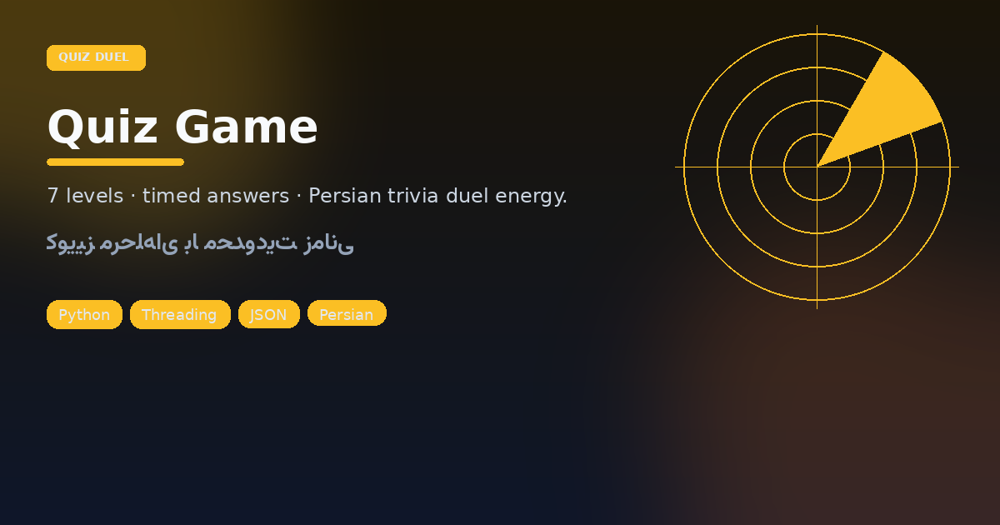

# Quiz Game · کوییز مرحله‌ای

<p align="center"></p>

<p align="center">


</p>

Inspired by the energy of Iranian **Quiz of Kings**-style duels — but offline, in your terminal, with a hard clock.

## Match format

| Knob | Value |
|------|-------|
| Levels | **7** |
| Questions / level | **5** |
| Time / question | **6 seconds** (threaded input) |
| Persist | `quiz_progress.json` |

Bank covers geography, science, literature, sports, and CS — all prompts in Persian.

```bash
python3 "Quiz game.py"
```

### English notes

- `get_timed_input` uses a daemon thread so slow answers expire.
- Progress save lets you resume a climb without replaying early levels.
- Pure stdlib + JSON — no network required.

---

## فارسی — شبیه‌ساز دوئل کوییز

حس رقابت مرحله‌ای: **۷ مرحله**، هر مرحله **۵ سوال**، و فقط **۶ ثانیه** برای پاسخ. سوال‌ها فارسی‌اند (جغرافیا، علوم، ادبیات، ورزش، برنامه‌نویسی). پیشرفت در `quiz_progress.json` ذخیره می‌شود تا از وسط مسیر ادامه دهید.

### اجرا

```bash
python3 "Quiz game.py"
```

### جزئیات فنی

| موضوع | رفتار |
|--------|--------|
| زمان‌بندی | ورودی زمان‌دار با `threading` |
| ذخیره | JSON محلی برای ادامه بازی |
| وابستگی | فقط کتابخانه استاندارد |

اگر دنبال یک بازی کنسولی «با فشار زمان» برای تمرین پایتون هستید، این همان حس دوئل کوتاه است — بدون سرور و بدون اینترنت.
