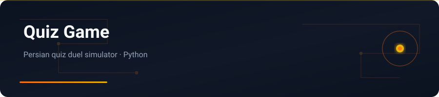

<div align="center">



</div>

# Quiz Game

Python simulator inspired by the Iranian Quiz-of-Kings style duel experience.

---

## English


### Features

- Turn-based quiz / duel style gameplay (see source for modes)
- Persian UI copy and prompts
- Lightweight Python script — easy to run and extend

### Stack

Python

### Getting started

```bash
git clone https://github.com/yasinfallahati/Quiz_game.git
cd Quiz_game
python "Quiz game.py"
```

---

## فارسی

### کوییز گیم

شبیه‌ساز پایتونی با حال‌وهوای بازی کوییز آو کینگز ایرانی.


### امکانات

- گیم‌پلی نوبتی سبک کوییز/دوئل (جزئیات در سورس)
- متن و رابط فارسی
- اسکریپت سبک پایتون — اجرای آسان و قابل توسعه

### تکنولوژی‌ها

Python

### شروع کار

```bash
git clone https://github.com/yasinfallahati/Quiz_game.git
cd Quiz_game
python "Quiz game.py"
```

---

`#python` `#quiz` `#game` `#persian` `#console`
